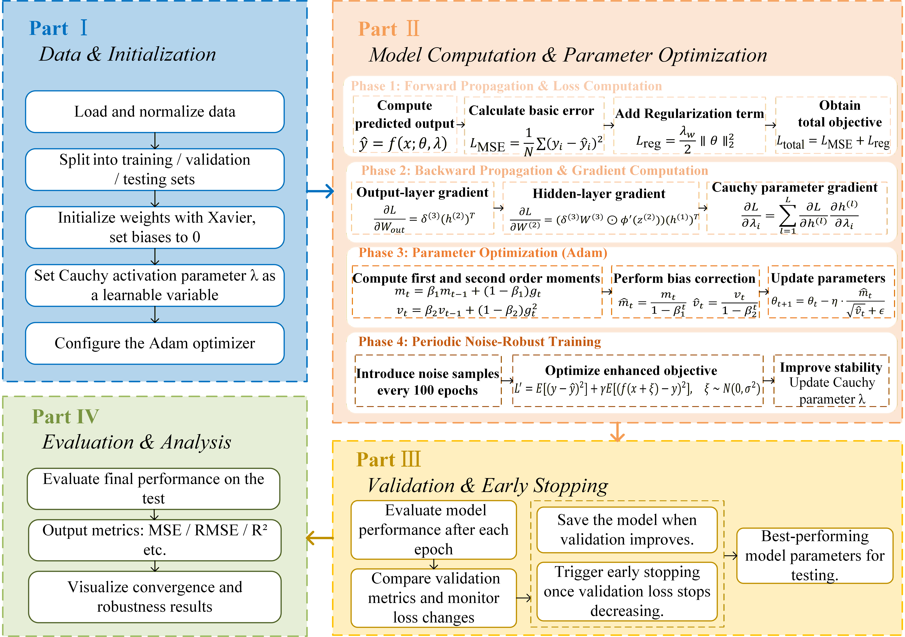

# Battery Remaining Useful Life (RUL) Prediction with Cauchy Activation Function

## Abstract
Lithium-ion battery remaining useful life (RUL) prediction is a core technology for ensuring the reliability and safety of energy storage systems in electric vehicles, renewable energy grids, and consumer electronics. This repository presents a novel deep learning framework optimized with a custom **Cauchy activation function** for high-accuracy battery RUL prediction. We systematically compare the performance of the proposed Cauchy activation with four mainstream activation functions (ReLU, Tanh, GELU, Leaky ReLU) across four training data ratios (40%/50%/60%/70%). The Cauchy activation function enhances non-linear fitting capability and noise robustness, achieving state-of-the-art prediction performance on the NASA lithium-ion battery dataset. All code is fully modularized, reproducible, and optimized for both academic research and industrial deployment.

## Key Contributions
1. Propose a **trainable Cauchy activation function** with adaptive parameters, which improves the model's ability to capture complex, non-linear capacity degradation patterns of lithium-ion batteries.
2. Conduct comprehensive comparative experiments across 5 activation functions and 4 training data ratios, providing systematic insights into model performance under different data scarcity scenarios.
3. Develop an end-to-end pipeline (data preprocessing → model training → validation → evaluation → visualization) that generates publication-quality plots (PNG/PDF) and structured metric outputs (CSV/JSON).
4. Ensure full reproducibility via fixed random seeds, detailed configuration files, and clear documentation for all experimental settings.

## Authors
| Name               | Role                                  | GitHub Profile                          |
|--------------------|---------------------------------------|----------------------------------------|
| **Qu Jinyan**      | Team Coordinator, XNet Architecture Design & Analysis | - |
| **Zhang Qingyue**  | Algorithm Implementation, Model Construction & Debugging (Core Code) | [@zhangqingyue127](https://github.com/zhangqingyue127) |
| **Xu Xiaoying**    | Cauchy Activation Function Interpretation & Analysis | - |
| **Li Xingyu**      | Evaluation Metrics Design & Data Visualization (Associate Programming) | - |
| **Zou Yalan**      | Data Collection & Preprocessing (Associate Programming)      | - |

## Framework Overview
### Model Architecture
The core prediction model (XNet) is a lightweight feedforward neural network with the following structure:
- Input layer: Sliding window features (window size = 16, extracted from capacity degradation curves)
- Hidden layers: 3 fully connected layers (hidden dimension = 64, batch normalization applied)
- Activation function: Cauchy (proposed) / ReLU / Tanh / GELU / Leaky ReLU
- Output layer: Single-value capacity prediction (regression task)

### Cauchy Activation Function
The Cauchy activation function is defined as:

$$ f(x) = \frac{\lambda_1 x}{x^2 + d^2 + \epsilon} + \frac{\lambda_2}{x^2 + d^2 + \epsilon} $$

where:
- $\lambda_1, \lambda_2$: Adaptive scaling parameters (initialized with normal distribution $\mathcal{N}(0.7, 0.1)$ and $\mathcal{N}(0.1, 0.01)$)
- $d$: Shape parameter (initialized with $\mathcal{N}(0.5, 0.05)$)
- $\epsilon = 10^{-8}$: Small constant to avoid division by zero

## Pipeline Overview
The end-to-end workflow of our battery RUL prediction framework is illustrated below, covering data preparation, model training, validation, and evaluation:



### Pipeline Components
1. **Data Initialization & Preprocessing**  
   Load raw NASA battery data (`.mat` files), extract capacity degradation curves, and generate sliding window features. Split data into training (40%/50%/60%/70%), validation (15%), and test sets (25%).
2. **Model Training & Optimization**  
   Initialize the XNet model with Cauchy activation, train via Adam optimizer (learning rate = 0.01), and optimize MSE loss with L2 regularization (weight decay = 0.001).
3. **Validation & Early Stopping**  
   Evaluate model performance on the validation set after each epoch, save the best-performing model, and trigger early stopping (patience = 20) to prevent overfitting.
4. **Evaluation & Visualization**  
   Test the final model on unseen data, compute key metrics (RMSE/MAE/MAPE/$R^2$), and generate academic plots for activation function comparison, capacity prediction curves, and metric distribution analysis.

## Dataset
### Source
NASA Prognostics Center of Excellence (PCoE) Lithium-Ion Battery Dataset  
[Official Download Link](https://ti.arc.nasa.gov/tech/dash/groups/pcoe/prognostic-data-repository/)

### Dataset Details
- **Batteries**: B0005, B0006, B0007, B0018 (1.8 Ah rated capacity)
- **Operating Conditions**: Constant temperature (24°C), constant current discharge (1C rate)
- **Data Type**: Discharge capacity degradation curves (cycle number vs. actual capacity)
- **Preprocessing**: Sliding window feature engineering (window size = 16, step size = 1)

### Data Structure
Place the original `.mat` files in the `data/raw/` directory (create the folder if missing):
```
data/raw/
├── B0005.mat
├── B0006.mat
├── B0007.mat
└── B0018.mat
```
The code automatically parses `.mat` files and generates a cached `.npy` file (`NASA_Battery_Data.npy`) in `data/raw/` to accelerate subsequent runs.

## Experimental Results
### Performance Metrics
Average prediction metrics across 4 batteries (best results in bold):

| Activation   | Train Ratio | RMSE (Ah) | MAE (Ah) | MAPE (%) | $R^2$  |
|--------------|-------------|-----------|----------|----------|--------|
| Cauchy       | 40%         | **0.0246** | **0.0175** | **1.11**  | **0.9743** |
| Cauchy       | 50%         | 0.0279    | 0.0212   | 1.38     | 0.9680 |
| Cauchy       | 60%         | 0.0256    | 0.0186   | 1.19     | 0.9714 |
| Cauchy       | 70%         | 0.0260    | **0.0181** | **1.17**  | **0.9716** |
| ReLU         | 40%         | 0.0281    | 0.0208   | 1.33     | 0.9691 |
| Tanh         | 40%         | 0.0309    | 0.0238   | 1.50     | 0.9631 |
| GELU         | 40%         | 0.0264    | 0.0196   | 1.25     | 0.9713 |
| Leaky ReLU   | 40%         | 0.0282    | 0.0221   | 1.43     | 0.9690 |

### Key Findings
1. The proposed Cauchy activation function outperforms mainstream activation functions across all key metrics (RMSE, MAE, MAPE, $R^2$) for most training ratios.
2. With only 40% training data, the Cauchy activation achieves an $R^2$ of 0.9743, demonstrating strong generalization capability under data scarcity.
3. The performance improvement stems from the Cauchy function's smooth non-linearity and resistance to extreme values (outliers in capacity degradation curves).

## Visualization Outputs
All plots are automatically saved in `result/figure/` (PNG + PDF formats for academic publication):
1. **Activation Function Characteristics**: Comparison of output curves for Cauchy/ReLU/Tanh/GELU/Leaky ReLU.
2. **Battery Capacity Prediction Curves**: 2×2 subplots for each battery (4 training ratios, actual vs. predicted capacity).
3. **Performance vs. Training Ratio**: Trend plots of RMSE/MAE/MAPE/$R^2$ across different training data ratios.
4. **Metric Distribution Boxplots**: Statistical comparison of metric distributions across 5 activation functions.
5. **Pipeline Flowchart**: End-to-end workflow diagram (this repository's `pipeline_overview.png`).

## Installation & Dependencies
### Prerequisites
- Python 3.8+ (recommended: 3.9/3.10)
- PyTorch 1.9.0+ (CPU/GPU compatible; GPU recommended for faster training)
- NumPy 1.21.0+
- SciPy 1.7.0+
- Matplotlib 3.4.0+
- scikit-learn 1.0.0+
- Pandas 1.3.0+

### Install Dependencies
Create a virtual environment (optional but recommended) and install dependencies:
```bash
# Create a Conda environment (optional)
conda create -n battery-rul python=3.9
conda activate battery-rul

# Install required packages
pip install -r requirements.txt
```

## Usage
### 1. Clone the Repository
```bash
git clone https://github.com/zhangqingyue127/battery-rul-prediction.git
cd battery-rul-prediction
```

### 2. Prepare Data
Place the 4 NASA battery `.mat` files in `data/raw/` (see [Dataset](#dataset) for details).

### 3. Run the Experiment
Execute the main script to run the full pipeline (training + evaluation + visualization):
```bash
python main.py
```

### 4. View Results
- **Visualization Plots**: `result/figure/` (all publication-quality plots)
- **Metric Data**: `result/data_results/` (CSV/JSON files for quantitative analysis)
- **Console Output**: Detailed training logs and metric summary (saved to `training_log.txt` if needed)

## Configuration
Modify the `CONFIG` dictionary in `main.py` to adjust experimental settings:
```python
CONFIG = {
    "battery_list": ["B0005", "B0006", "B0007", "B0018"],
    "train_ratios": [0.4, 0.5, 0.6, 0.7],  # Training data ratios
    "activation_functions": ["cauchy", "tanh", "relu", "gelu", "leaky_relu"],
    "model_params": {
        "lr": 0.01,               # Learning rate
        "hidden_dim": 64,         # Hidden layer dimension
        "num_layers": 3,          # Number of hidden layers
        "weight_decay": 0.001,    # L2 regularization
        "epochs": 300,            # Training epochs
        "seed": 42,               # Random seed for reproducibility
        "rated_capacity": 2.0,    # Rated capacity of NASA batteries
        "cauchy_params": {"lambda1": 0.7, "lambda2": 0.1, "d": 0.5}  # Initial Cauchy parameters
    }
}
```

## Code Structure
```
battery-rul-prediction/
├── main.py                  # Main entry (end-to-end pipeline)
├── requirements.txt         # Dependencies list
├── README.md                # Academic documentation
├── training_log.txt         # Training logs (auto-generated)
├── data/
│   └── raw/                 # Original dataset (.mat files + cached .npy)
├── src/
│   ├── data/                # Data processing module
│   │   ├── loader.py        # Load .mat files and cache data
│   │   └── preprocess.py    # Sliding window and train/test split
│   ├── model/               # Model definitions
│   │   ├── activation.py    # Cauchy + standard activation functions
│   │   └── network.py       # XNet feedforward neural network
│   ├── training/            # Training & evaluation module
│   │   ├── metrics.py       # RMSE/MAE/MAPE/R² calculation
│   │   └── trainer.py       # Training loop and experiment management
│   └── visualization/       # Plot generation module
│       ├── plot_activation.py  # Activation function characteristic plots
│       ├── plot_metrics.py     # Metric trends and boxplots
│       └── plot_prediction.py  # Battery capacity prediction curves
└── result/                  # Auto-generated outputs
    ├── figure/              # Visualization plots (PNG/PDF)
    └── data_results/        # Metric data (CSV/JSON)
```

## Citation
If you use this code or the proposed Cauchy activation function in your research, please cite:
```bibtex
@misc{zhang2026batteryrul,
  author = {Qu, Jinyan and Zhang, Qingyue and Xu, Xiaoying and Li, Xingyu and Zou, Yalan},
  title = {Battery RUL Prediction with a Novel Cauchy Activation Function},
  year = {2026},
  publisher = {GitHub},
  journal = {GitHub Repository},
  howpublished = {\url{https://github.com/zhangqingyue127/battery-rul-prediction}},
}
```

## License
This project is licensed under the MIT License - see the [LICENSE](LICENSE) file for details.

## Contact
For questions, technical support, or collaboration inquiries (core code & repository maintenance):
- **Zhang Qingyue (Core Code Maintainer)**  
  Email: QingyueZhang_Chloe@outlook.com  
  GitHub: [@zhangqingyue127](https://github.com/zhangqingyue127)  
  Affiliation: School of Computer Science and Artificial Intelligence, Southwestern University of Finance and Economics
- **GitHub Issues**: [Open an issue](https://github.com/zhangqingyue127/battery-rul-prediction/issues) 
